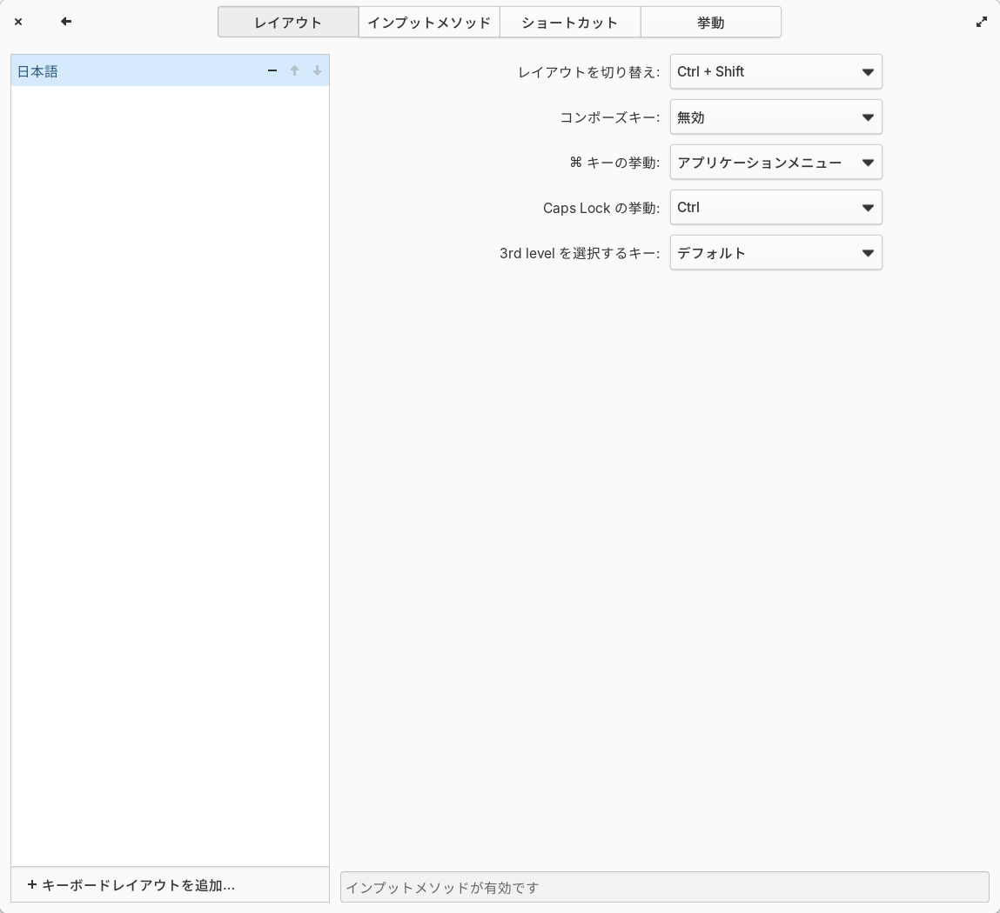

# Elementary OS 8 セットアップ手順

- [本題](#本題)
- [事前準備](#事前準備)
- [各種設定](#各種設定)
  - [初期セットアップ](#初期セットアップ)
  - [日本語入力を有効化](#日本語入力を有効化)
  - [Google Chromeのインストール](#google-chromeのインストール)
  - [VSCodeのインストール](#vscodeのインストール)
  - [Gitのインストール](#gitのインストール)
  - [Dockerのインストール](#dockerのインストール)

## 本題

`Elementary OS 8`はUbuntu 24.04LTSをベースとしたMacライクなOSである。本当は安直にUbuntuを入れようかと思っていたが、せっかくなので使った経験のないOSを導入してみることにした。RHEL系はCentOSの件があって以来、決定版的なOSを見つけられていないので却下。

本稿はWindows10をディスクから削除してElementary OS 8を導入＆セットアップした手順を残す。

## 事前準備

- Elementary OS 8のISOイメージをダウンロードし、[Rufas](https://rufus.ie/ja/)で不要なUSBメモリからインストールメディアを作成しておく
- USBメモリを挿れた状態でBIOSを起動しディスクを上書きする（Windows削除）

## 各種設定

### 初期セットアップ

```bash
# いつもの
sudo apt update
sudo apt upgrade

# 端末名の変更
sudo hostnamectl set-hostname [XXX]

# 時刻の設定
timedatectl list-timezones | grep To
timedatectl set-timezone Asia/Tokyo

# firewallの有効化
# デフォルト無効のため即座に有効化すること
sudo ufw status verbose  # 非アクティブ
sudo ufw enable
sudo ufw status verbose  # アクティブ
```

### 日本語入力を有効化

- 初期設定時に日本語を選択すると`ibus-mozc`が自動インストールされるが、そのままでは日本語入力できないため少々追加で設定が必要
- キーボードの`レイアウト`は`日本語(デフォルト)`を選択



- `インプットメソッド`が空だと日本語入力できないため`日本語(Mozc)`を追加する
- バー右上にある`ja`を押下し`日本語(Mozc)`にチェックが入っていれば日本語入力できるはず


### Google Chromeのインストール

- デフォルトのブラウザからChromeを落として以下を実行
- Elementary OS 8ではデフォルトで`AppCenter`が有効になっておりここから通常アプリをインストールするが、Chromeのダウンロードは失敗したため`apt install`する

```bash
# ダウンロード済みの.debファイルを指定してインストール
sudo apt install /home/xxx/ダウンロード/google-chrome-stable_current_amd64.deb
```

- ちなみにChromeだと高速だがデフォルトの謎のブラウザアプリでWEBページを開くと激重だった
- 使い物にならないのでおとなしくChromeを入れるべき

### VSCodeのインストール

```bash
# MicrosoftのGPGキーをダウンロードし、microsoft.gpgとして保存
curl https://packages.microsoft.com/keys/microsoft.asc | gpg --dearmor > microsoft.gpg

# GPGキーをAPTが利用する信頼済み鍵ディレクトリに配置
# -o root / -g root / -m 644 でオーナー＆グループをroot、パーミッション644に設定
sudo install -o root -g root -m 644 microsoft.gpg /etc/apt/trusted.gpg.d/

# VSCode用のリポジトリ情報をaptのソースリストに追加
# [arch=amd64] は64bitアーキテクチャ向けのパッケージを対象とする設定
sudo sh -c 'echo "deb [arch=amd64] https://packages.microsoft.com/repos/vscode stable main" > /etc/apt/sources.list.d/vscode.list'

# HTTPS経由のパッケージ取得に必要なパッケージをインストール
sudo apt install apt-transport-https

# パッケージリストを更新
sudo apt update

# VSCode本体をインストール
sudo apt install code

# VSCodeの起動
code
```

### Gitのインストール

```bash
# Gitのインストール
sudo apt install git

# GitHub CLI (gh)のインストール
sudo apt install gh -y

# GitHubにログイン (トークンの入力やブラウザを使った認証を行う)
gh auth login

# Git設定: コミット時に使う名前とメールアドレス
git config --global user.name "hoge"
git config --global user.email "hoge@hoge"
```

### Dockerのインストール

```bash
# Docker関連のリポジトリを追加するために必要なパッケージをインストール
sudo apt install ca-certificates curl gnupg

# Dockerの公式GPGキーをダウンロードしてaptが参照できる位置に配置
sudo curl -fsSL https://download.docker.com/linux/ubuntu/gpg -o /etc/apt/keyrings/docker.asc
sudo chmod a+r /etc/apt/keyrings/docker.asc

# リポジトリを追加
# 通常は lsb_release -cs（Ubuntuのコード名）を使うが、Elementary OSでは値が合わない
# ここではUbuntu24.04 LTSのコード名である "noble" を直接指定
echo "deb [arch=$(dpkg --print-architecture) signed-by=/etc/apt/keyrings/docker.asc] https://download.docker.com/linux/ubuntu noble stable" | sudo tee /etc/apt/sources.list.d/docker.list > /dev/null

# パッケージリストを更新し、Docker関連パッケージをインストール
sudo apt update
sudo apt install docker-ce docker-ce-cli containerd.io docker-buildx-plugin docker-compose-plugin

# dockerグループに現在のユーザを追加
# これにより sudo を付けなくても docker コマンドを利用可能に
# ※ 反映には再ログインが必要
sudo usermod -aG docker $USER
```
